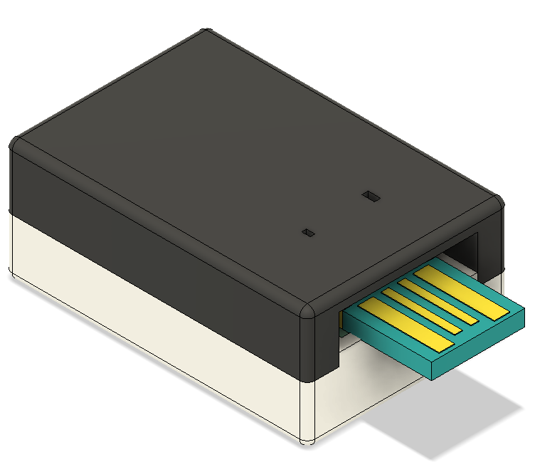
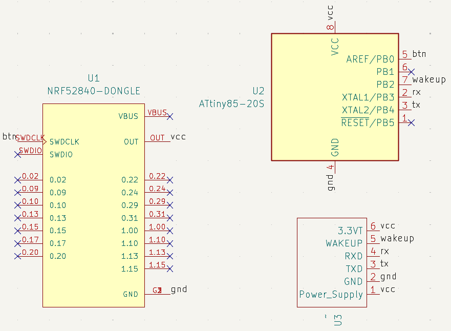
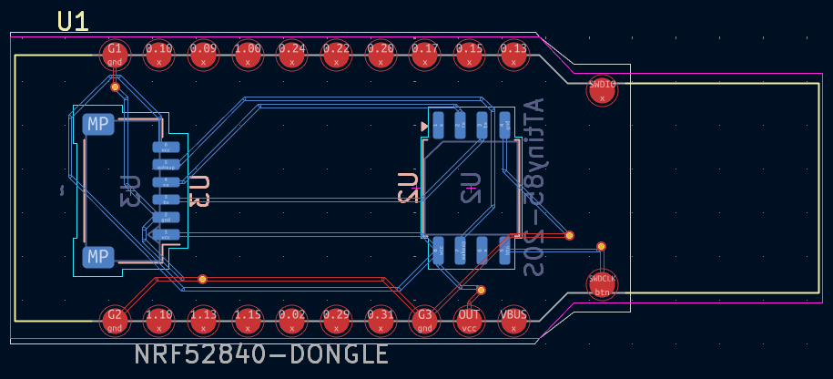

# Sekey

- [Sekey](#sekey)
  - [Journal](#journal)
  - [PCB](#pcb)
    - [Schematic](#schematic)
    - [PCB Design](#pcb-design)
  - [BOM](#bom)

A FIDO2 compliant USB security key with a fingerprint scanner for safety. I made this because I've seen commercial versions of this like the YubiKey, but wanted to create my own one, which has space for a fingerprint scanner that can be used to increase security.

## Journal

Can be found in [`JOURNAL.md`](JOURNAL.md).

If you're wondering why the journal is barren, and your name isn't cyao, dm me in the Slack. If you're cyao, I already told you why teeheehee.

> [!NOTE]\
> Total time spent: **35h**

## PCB

### Schematic

### PCB Design

## BOM

$90.01 in USD.

 Click to open (closed by default to save space)

| Component              | Description | Notes                                                                                | Quantity | Price      | Shipping | Provider   | Link                                                               |
| ---------------------- | ----------- | ------------------------------------------------------------------------------------ | -------- | ---------- | -------- | ---------- | ------------------------------------------------------------------ |
| nrf52840 Dongle        |             | Not on AliExpress                                                                    | 2        | £15.20     | £12.00   | Mouser     | [Link](https://www.mouser.co.uk/ProductDetail/949-NRF52840-DONGLE) |
| ATTINY85-20F           | SMD one     | Couldn't find this SMD one on AliExpress either                                      | 2        | £2.18      |          |            | [Link](https://www.mouser.co.uk/ProductDetail/556-ATTINY85-20SF)   |
| **Total (Mouser)**     |             |                                                                                      |          | **£29.38** |          |            |                                                                    |
|                        |             |                                                                                      |          |            |          |            |                                                                    |
| JST SH 1.00mm          | Connector   | To get a connector to solder to the PCB                                              |          | £3.82      |          | AliExpress | [Link](https://www.aliexpress.com/item/1005005787575387.html)      |
| Ceramic Capacitor      |             | Needed when writing code to the ATTiny apparently                                    |          | £3.30      |          |            | [Link](https://www.aliexpress.com/item/1005007540183265.html)      |
| Official UNO R3        |             | Needed to write code to the ATTiny, luckily very cheap                               |          | £5.82      |          |            | [Link](https://www.aliexpress.com/item/1005006967612048.html)      |
| Fingerprint Sensor     |             |                                                                                      | 2        | £11.69     | £4.68    |            | [Link](https://www.aliexpress.com/item/4000251947139.html)         |
| Resistor               | 10K         | Again when writing code, helps prevent fluctuations                                  | 1        | £0.47      | £2.46    |            | [Link](https://www.aliexpress.com/item/1005001439536671.html)      |
| Programmer Test clip   | SOP8        | To hold the ATTiny in the breadboard when writing code to it ‘cus it’s SMD of course | 1        | £0.99      | £2.75    |            |                                                                    |
| **Total (AliExpress)** |             |                                                                                      |          | **£35.98** |          |            |                                                                    |
|                        |             |                                                                                      |          |            |          |            |                                                                    |
| PCB                    |             |                                                                                      |          | £1.58      | £1.13    |            |                                                                    |
|                        |             |                                                                                      |          | **£2.71**  |          |            |                                                                    |
|                        |             |                                                                                      |          |            |          |            |                                                                    |
| **TOTAL**              |             |                                                                                      |          | **£68.07** |          |            |                                                                    |

